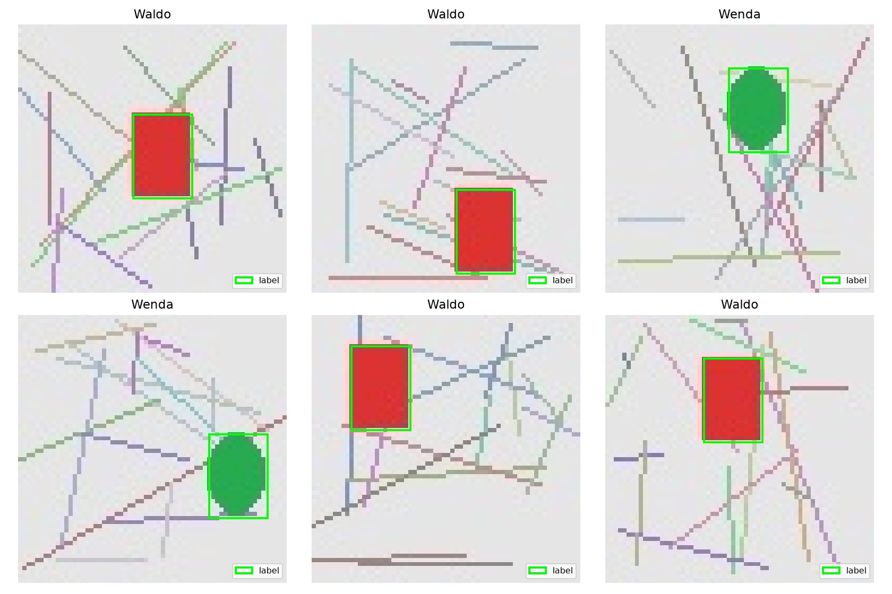
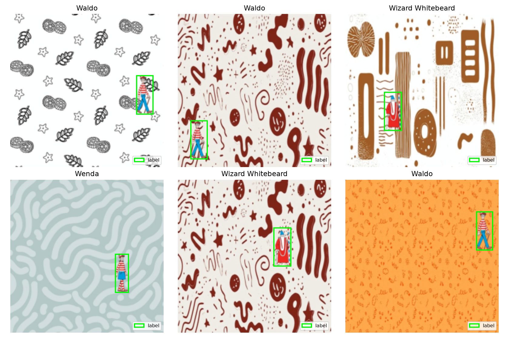
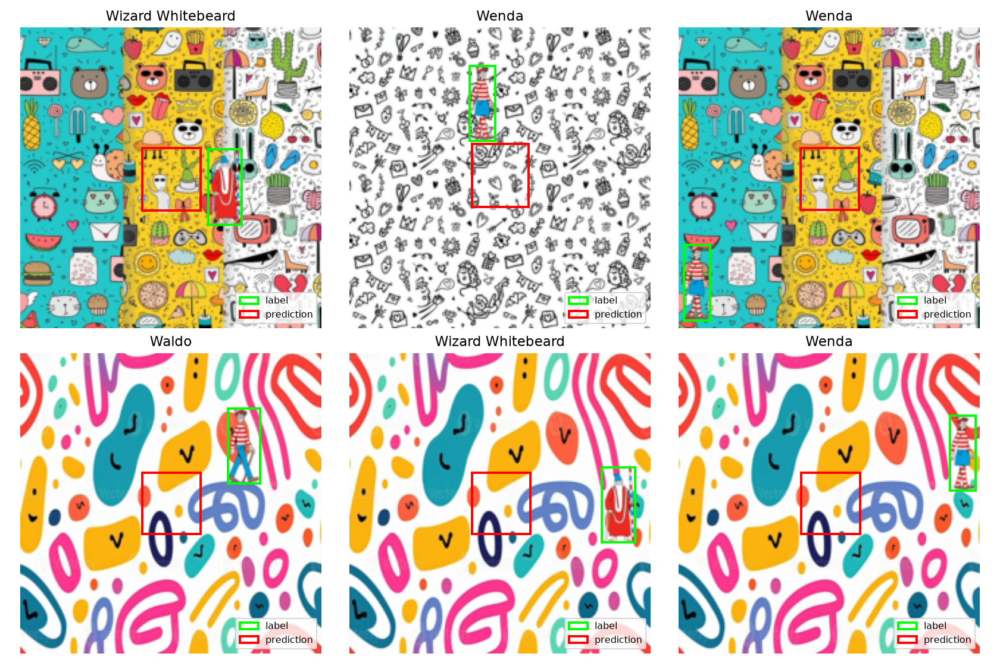

**The corrected character-data benchmark is pending.** No historical
scores are reused, and the repository remains private.

### Execution check

The notebook completed a two-epoch CPU execution check on 24 training,
6 validation and 6 test geometric fixtures. This exercises the custom
pipeline through generation, training, checkpoint selection, evaluation
and figure export. YOLO is skipped in this mode.

Fixture scores are not evidence of character detection accuracy.

### Real-image pilot

A short run used 96 training, 24 validation and 24 test character composites,
with two custom-model epochs and one YOLO epoch. Both models were evaluated
on the held-out test images. This validates execution of the real-data path;
it is not the planned 20/100-epoch benchmark.

| Shared-protocol metric | Custom (2 epochs) | YOLOv8n (1 epoch) |
| --- | --- | --- |
| precision | 0.0000 | 0.2500 |
| recall | 0.0000 | 0.2500 |
| mean_iou | 0.0452 | 0.3243 |
| map50_all_points | 0.0000 | 0.1129 |

