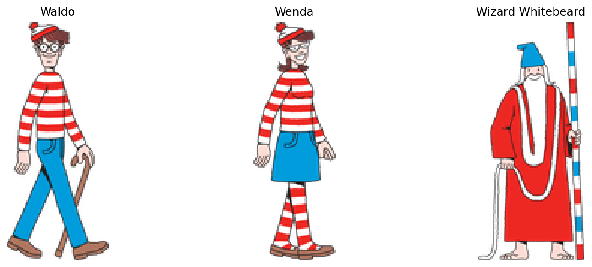
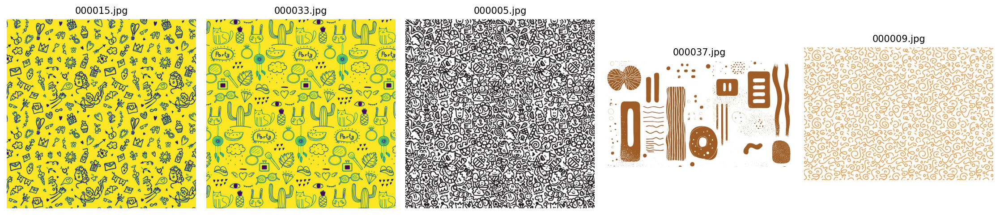
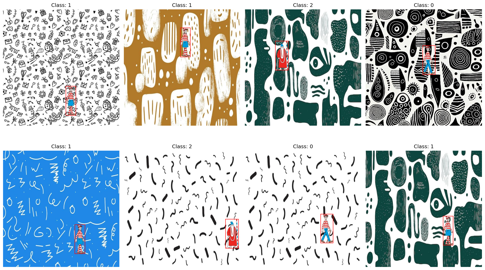
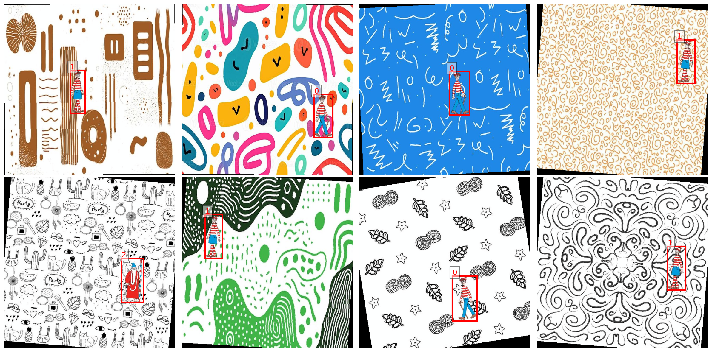
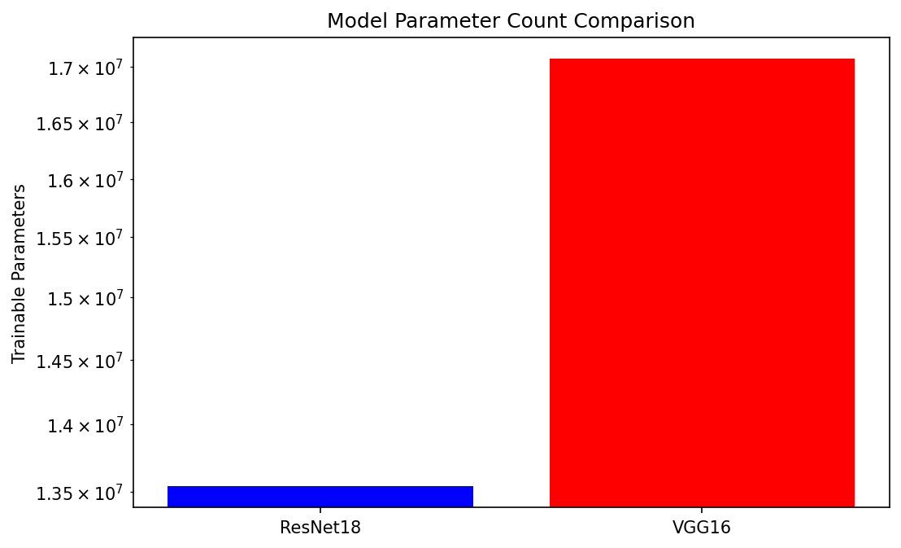
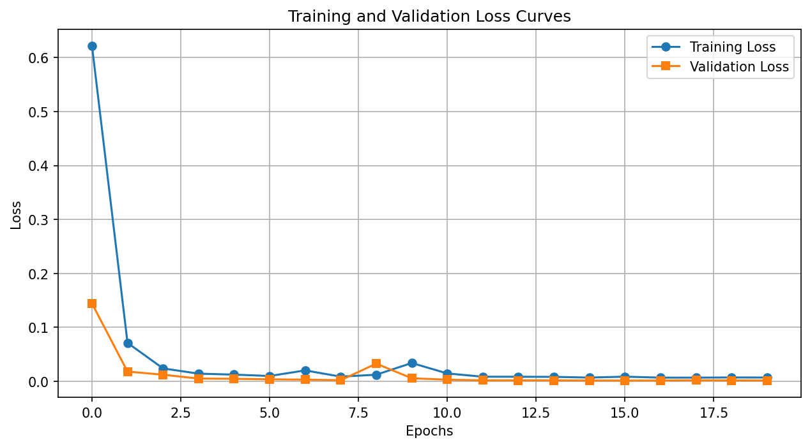
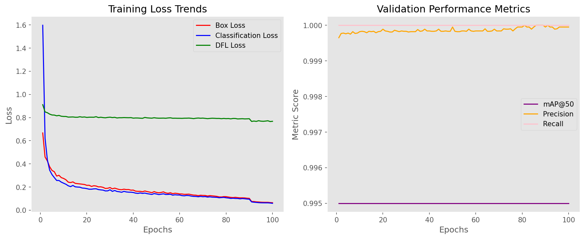
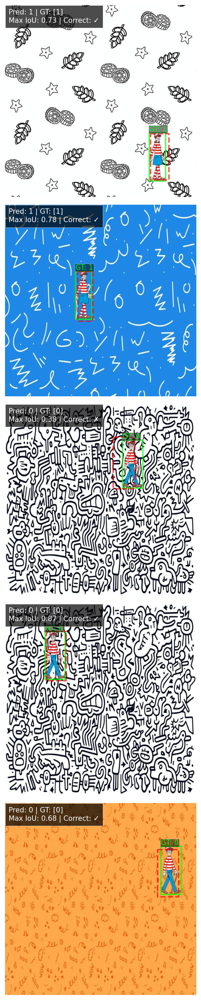
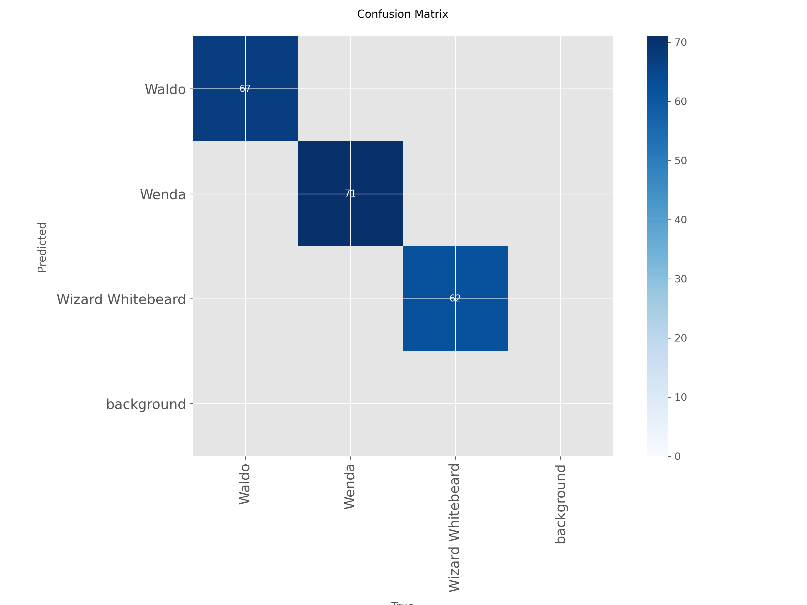
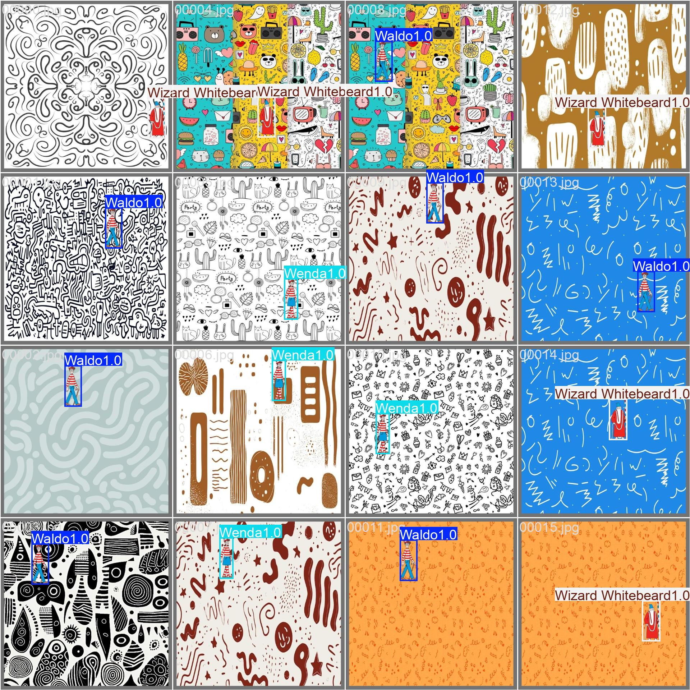

::: {.stat-row}
::: {.stat}
**131 / 200**
*held-out scenes where the class is right and the box clears IoU 0.5*
:::
::: {.stat}
**0.575**
*mean IoU between predicted and true boxes*
:::
::: {.stat}
**0.0015**
*best validation loss, reached at epoch 16*
:::
::: {.stat .alt}
**0.995**
*YOLOv8n native mAP50-95 on the same files*
:::
:::

[The custom detector reaches a validation loss of 0.0015 and still misses the box
on roughly a third of the test set.]{.lead-in} That gap between a converged
training curve and a correct detection is what this report is about.

## Overview

A detector must answer two questions: **what is in the image, and where is it?**
This experiment separates those questions in a custom PyTorch model, then tests
it against a pretrained YOLOv8n detector fine-tuned on the same images.

The task is deliberately controlled. A transparent character is placed at a
known location on a cluttered background, so its class and bounding box are
available without manual annotation. The custom detector correctly identifies
and localizes **131 of 200 test objects** at an IoU threshold of 0.5. YOLO reaches
**0.995 native mAP50–95** on that same test split. These are different measures,
but together they show the practical gap between the custom baseline and a
pretrained detector on this task. The high YOLO score must also be read in the
context of the constrained synthetic data.

The [executed notebook](https://github.com/O-2wice/synthetic-object-detection/blob/main/notebooks/object-detection.ipynb) supplies the code,
figures and measurements discussed here. The aim is to follow a complete
example from image construction to a detection decision, and understand why
good-looking training curves do not necessarily imply accurate boxes.

[](https://colab.research.google.com/github/O-2wice/synthetic-object-detection/blob/main/notebooks/object-detection.ipynb)
&nbsp;
[Browse the repository](https://github.com/O-2wice/synthetic-object-detection)

## Building a task with exact labels

The three classes are Waldo, Wenda and Wizard Whitebeard. Their prepared PNGs
retain transparency and have fixed dimensions of 68 × 160, 55 × 160 and
71 × 160 pixels respectively. They are composited onto 640 × 640 images from
a reviewed pool of 22 doodle backgrounds.

{#fig-objects}

{#fig-backgrounds}

The cut-outs come from Candlewick Press character sheets, with illustrations
by Martin Handford. The source PDF, preparation details and background source
records are retained in [the data documentation](DATA.md). Wenda replaces the
unavailable Wilma asset from the earlier notebook.

### Compositing creates the supervision

::: {.pipeline}
<svg viewBox="0 0 980 200" role="img" aria-labelledby="pl-title pl-desc" xmlns="http://www.w3.org/2000/svg">
<title id="pl-title">How a labelled scene is built</title>
<desc id="pl-desc">A background and a transparent character cut-out are combined: the cut-out is cropped to its visible pixels, placed at a random position, alpha composited onto the background, and the placement written out as a normalized label.</desc>
<rect class="pl-in" x="6" y="14" width="150" height="60" rx="5"/>
<rect class="pl-in" x="6" y="106" width="150" height="60" rx="5"/>
<rect class="pl-step" x="220" y="60" width="150" height="60" rx="5"/>
<rect class="pl-step" x="430" y="60" width="150" height="60" rx="5"/>
<rect class="pl-step" x="640" y="60" width="150" height="60" rx="5"/>
<rect class="pl-out" x="850" y="56" width="124" height="68" rx="5"/>
<text class="pl-t" x="81" y="40">background</text>
<text class="pl-s" x="81" y="59">640 × 640</text>
<text class="pl-t" x="81" y="132">cut-out</text>
<text class="pl-s" x="81" y="151">RGBA, transparent</text>
<text class="pl-t" x="295" y="86">crop to alpha</text>
<text class="pl-s" x="295" y="105">drop empty margins</text>
<text class="pl-t" x="505" y="86">place at random</text>
<text class="pl-s" x="505" y="105">position (x, y)</text>
<text class="pl-t" x="715" y="86">composite</text>
<text class="pl-s" x="715" y="105">α·fg + (1−α)·bg</text>
<text class="pl-t" x="912" y="80">label</text>
<text class="pl-m" x="912" y="100">1 0.199 0.437</text>
<text class="pl-m" x="912" y="116">0.086 0.250</text>
<path class="pl-a" d="M156 44 H188 V88 H216"/>
<path class="pl-a" d="M156 136 H188 V92 H216"/>
<path class="pl-a" d="M370 90 H426"/>
<path class="pl-a" d="M580 90 H636"/>
<path class="pl-a" d="M790 90 H846"/>
</svg>

Placement *is* the supervision. Because the generator chooses the position, the
box is recorded rather than estimated, so every label is exact by construction.
:::


A PNG has an alpha channel as well as its red, green and blue channels. Alpha
describes opacity: zero lets the background show through, one makes the
foreground fully visible, and intermediate values blend the two. For each
colour channel, the compositor calculates

$$
I_{\text{scene}}=\alpha I_{\text{character}}+(1-\alpha)I_{\text{background}}.
$$

Before placing the character, the generator crops away transparent margins.
Otherwise the label would describe the PNG canvas rather than the extent of
the visible cut-out. It then selects a background, chooses one of the three
characters and samples a position where the cut-out fits, with a small buffer
from the image edges. Character size stays fixed in the saved dataset.

This process provides supervision automatically. We know which character was
selected and exactly where its cropped image was placed. The bounding box is
the rectangle enclosing that cut-out, not a pixel-by-pixel segmentation mask.
Transparent space inside the rectangle still belongs to the box.

### Turning placement into a target

Each saved scene contains exactly one character. Given its upper-left position
$(x,y)$ and size $(w,h)$, the normalized label is

$$
[c_x,c_y,b_w,b_h]
=\left[\frac{x+w/2}{640},\frac{y+h/2}{640},\frac{w}{640},\frac{h}{640}\right].
$$

The text label adds the class ID before those four coordinates. The same image
and label files feed both models.

For a concrete example, place the 55 × 160 Wenda cut-out at pixel position
$(100,200)$. Its centre is $(127.5,280)$, so the saved row is

```text
1   0.19921875   0.4375   0.0859375   0.25
│        │          │          │        │
│        │          │          │        └─ height    160 / 640
│        │          │          └────────── width      55 / 640
│        │          └───────────────────── centre-y  280 / 640
│        └──────────────────────────────── centre-x  127.5 / 640
└───────────────────────────────────────── class 1 = Wenda
```

Every value after the class is a division by the image dimension, which is what
makes the row independent of resolution: a centre-x of 0.5 is halfway across the
image whether that image is 640 pixels wide or 224. Nothing about the character's
identity is encoded in the four coordinates, and nothing about its position is
encoded in the class. The two heads of the detector learn these separately for
exactly that reason.

The placement above is chosen to show the arithmetic; the saved dataset uses
positions drawn at random.

To draw the rectangle again, reverse the calculation:
$x_1=(c_x-b_w/2)W$, $y_1=(c_y-b_h/2)H$, $x_2=(c_x+b_w/2)W$ and
$y_2=(c_y+b_h/2)H$. Keeping the centre format and corner format distinct is
essential: the network predicts the former, while plotting and overlap
calculations use the latter.

### What belongs in each split

Training images supply gradients that update model weights. Validation images
help select a checkpoint and adjust the learning rate. Test images assess the
selected model after training. Using the test result to choose a checkpoint
would make it part of model selection rather than an independent assessment.

| Split | Images | Waldo | Wenda | Wizard Whitebeard |
|---|---:|---:|---:|---:|
| Training | 5,000 | 1,637 | 1,707 | 1,656 |
| Validation | 1,000 | 342 | 333 | 325 |
| Test | 200 | 67 | 71 | 62 |

{#fig-scenes}

The dataset is a frozen archive with hashes for all image and label files.
Local and Colab runs download and verify this archive instead of generating a
new sample. The Drive export's dataset archive matches the published checksum.

**The split holds out composites, not source artwork.** All three splits draw
on the same characters and the same background pool, so what the test set
measures is generalization to new *placements* of familiar visual material. That
is the question this dataset is built to answer, and the scores below should be
read as answering it.

## From image files to training batches

The PyTorch dataset pairs each image filename with its text label. It returns
an RGB image tensor and one label row. Before returning the sample, it checks
that the class is valid, the coordinates are finite, the box has positive area
and the label fits inside the image. An invalid label should stop the run:
silently treating it as an empty image would change the task being learned.

### Image normalization and box normalization are different

`ToTensor()` converts byte-valued image pixels into floating-point values in
$[0,1]$ and arranges the channels first. The ImageNet-pretrained backbone then
receives the channel normalization used by this notebook:

```python
transforms.Normalize(
    mean=[0.485, 0.456, 0.406],
    std=[0.229, 0.224, 0.225]
)
```

For each channel, this subtracts its mean and divides by its standard
deviation. Those image values can become negative. The bounding-box targets
are not passed through this transform: their normalization is geometric,
dividing coordinates by image width or height. Confusing these two operations
would give the model the wrong targets.

When displaying an image, the notebook reverses the channel normalization
using $I=I_{\text{normalized}}\sigma+\mu$. This is why the visual checks can
show recognizable colours even though the model receives standardized inputs.

### An augmentation must move the label too

Training applies a horizontal flip with probability 0.5 and a rotation sampled
between −10° and +10°. A flipped image with an unchanged box would teach the
model to predict a location where the character no longer appears.

For a horizontal flip, the normalized centre transforms as
$c_x'=1-c_x$; width, height and centre-y stay unchanged. The notebook performs
both operations together:

```python
if random.random() < .5:
    image = image.transpose(Image.Transpose.FLIP_LEFT_RIGHT)
    labels[:,1] = 1-labels[:,1]
```

Rotation is less direct. The code converts the box into four pixel-space
corners, rotates them about the image centre using the same angle as the
image, then takes their minimum and maximum coordinates. That gives an
axis-aligned rectangle enclosing the rotated box; its boundaries are clipped
to the image and converted back to normalized centre coordinates. The new
rectangle can contain more background than the old one. It encloses a rotated
rectangle rather than tracing the character's silhouette.

Validation and test images receive no random geometric augmentation. They
retain their saved labels and use only tensor conversion and channel
normalization.

{#fig-training-batch}

### Reading tensor shapes

The dataloader stacks samples so the model can process several images in one
forward pass. Training shuffles their order; validation and test loading do
not. With a full training batch of 16, the important shapes are:

| Tensor | Shape | Meaning |
|---|---|---|
| Images | `16 × 3 × 640 × 640` | Batch, RGB channels, height, width |
| Labels | `16 × 1 × 5` | One row per image: class and four coordinates |
| Class targets after unpacking | `16` | One integer class ID per image |
| Box targets after unpacking | `16 × 4` | One normalized box per image |

The separate test-evaluation cells use batches of eight. Changing batch size
does not change how many test images are evaluated. The last batch can be
smaller, and epoch loss is weighted by the number of images rather than
treating a short batch as equal to a full one.

## A custom detector with two heads

The custom model uses an ImageNet-pretrained ResNet18 feature extractor. Its
final spatial feature map is pooled to a **3 × 3 grid**, flattened to 4,608
features, and passed to separate classification and bounding-box heads.

The backbone's original image-classification layer is removed. Its convolutional
features are reused because patterns learned for ImageNet classification can
provide a useful starting point for this smaller task. During custom training,
the backbone is fine-tuned along with the new heads. It is not merely a frozen
feature calculator.

```python
self.pool_grid = pool_grid
self.global_pool = nn.AdaptiveAvgPool2d((pool_grid, pool_grid))
feature_dim = feature_dim * pool_grid * pool_grid
```

This excerpt comes from the executed notebook. A global 1 × 1 average removes
the feature map's spatial arrangement; retaining nine regions gives the heads
coarse location information. `POOL_GRID = 1` remains available to reproduce the
earlier pooling architecture. **This report contains one completed 3 × 3 run,
not a controlled pooling ablation.** An improvement caused specifically by the
grid would require matched runs of both settings.

The classification branch uses a 256-unit hidden layer with ReLU, batch
normalization and dropout before predicting three logits. The regression branch
uses a 256-unit hidden layer with ReLU and batch normalization before predicting
four coordinates. Its outputs are unconstrained: training penalizes inaccurate
coordinates rather than forcing them into $[0,1]$.

ReLU introduces a nonlinearity between the two linear layers. Without it, two
successive linear maps would still be one linear map. Batch normalization uses
batch statistics during training and stored running statistics during
evaluation. Dropout randomly removes a fraction of the classification branch's
activations while training; it is disabled during evaluation. These behaviours
are why switching between `model.train()` and `model.eval()` matters even when
the weight values have not changed.

The classifier emits **logits**, not probabilities. `argmax` selects the most
likely class directly from those scores. For confidence-ranked evaluation,
softmax converts them into values summing to one. The regression head has no
sigmoid because the retained architecture directly learns coordinates from
the loss. Predictions with nonfinite coordinates or nonpositive box dimensions
receive zero IoU in evaluation.

The computational path is compact:

| Stage | Representation | Purpose |
|---|---|---|
| ResNet18 feature extractor | 512 spatial feature channels | Encode image patterns |
| Adaptive average pool | 512 × 3 × 3 | Retain coarse spatial arrangement |
| Flatten | 4,608 features | Supply both prediction heads |
| Classification head | 3 logits | Select the character class |
| Box regression head | 4 coordinates | Locate the character |

ResNet18 and VGG16 variants are inspected in the notebook. Only the ResNet18
custom detector is trained for the results here. It has **13,539,143 parameters**;
the VGG16 inspection is not a second trained baseline.

{#fig-parameters}

## Teaching both heads with one loss

The model has two kinds of target. Class identity is categorical; box position
and size are continuous. The loss combines classification and localization:

$$
\mathcal L = \mathcal L_{\mathrm{cross\ entropy}}
           + 5\,\mathcal L_{\mathrm{Smooth\ L1}}.
$$

Cross-entropy consumes the class logits. Smooth L1 operates on normalized box
coordinates. A low coordinate loss is useful, but it does not directly optimize
IoU: for a narrow character, a small horizontal displacement can substantially
reduce box overlap.

Cross-entropy penalizes assigning low probability to the correct class. It
uses the logits directly, so the training code must not apply softmax before
passing them to `CrossEntropyLoss`. Smooth L1 is quadratic near zero error and
linear for larger errors. With its default transition at one, its coordinate
penalty for residual $r$ is

$$
\ell(r)=\begin{cases}
\tfrac12r^2,& |r|<1,\\
|r|-\tfrac12,& |r|\geq1.
\end{cases}
$$

The weight of five multiplies the box term; it is not five times the IoU or
five extra training passes. It changes the relative contribution of the two
objectives to the gradients. The implementation returns the total as well as
the individual components:

```python
class_loss = self.classification_loss(pred_classes, true_classes)
bbox_loss = self.bbox_loss(pred_bboxes, true_bboxes)
total_loss = self.lambda_cls * class_loss + self.lambda_bbox * bbox_loss
return total_loss, class_loss, bbox_loss
```

Both heads feed gradients back through their shared features. A parameter
update can therefore affect both class recognition and localization. The
reported training and validation curves use this combined loss; neither curve
is an accuracy percentage.

### Why a small coordinate error can still miss the object

Consider two boxes with the correct width and height, aligned vertically but
offset horizontally by $d$ pixels. For $0 \leq d < w$,

$$
\operatorname{IoU}=\frac{(w-d)h}{(w+d)h}=\frac{w-d}{w+d}.
$$

An IoU of 0.5 corresponds to $d=w/3$. For the 55-pixel-wide Wenda cut-out,
that is only **18.3 pixels**, or **0.029** in normalized image coordinates.
This calculation is an illustration, not a measurement of a particular
prediction. It explains why a small regression loss can coexist with a
substantial number of failed detections, especially for narrow targets.

## Training and selecting checkpoints

| Setting | Custom ResNet18 | YOLOv8n |
|---|---|---|
| Image size | 640 × 640 | 640 × 640 |
| Batch size | 16 | 16 |
| Training completed | 20 epochs | 100 epochs |
| Optimization | Adam, initial learning rate 0.0001 | Ultralytics automatic optimizer selection |
| Augmentation | Paired horizontal flip and rotation up to ±10° | Native YOLO augmentation, including mosaic |
| Selection | Lowest validation composite loss | Native YOLO validation fitness |
| Execution | CUDA mixed precision | CUDA mixed precision |

Custom image transforms update boxes alongside pixels. YOLO's mosaic can place
multiple saved scenes into one augmented training image, even though each
stored scene contains only one target. The training budgets and augmentation
policies differ, so this is a practical reference comparison rather than a
controlled test of architecture alone.

### What happens in one training step

Each batch passes through the backbone and both heads. The class and box
predictions are compared with their targets, and the total loss supplies the
gradients used to update the parameters. The notebook's central update is:

```python
optimizer.zero_grad()
with torch.amp.autocast('cuda',enabled=USE_AMP):
    class_preds, bbox_preds = model(images)
    loss, _, _ = criterion(class_preds, labels, bbox_preds, boxes)
if not torch.isfinite(loss): raise FloatingPointError('Nonfinite training loss')
scaler.scale(loss).backward()
scaler.step(optimizer)
scaler.update()
```

`zero_grad()` clears gradients left by the previous batch. The forward pass
produces predictions, and `backward()` computes how changing each trainable
parameter would change the loss. Adam uses those gradients together with its
running estimates of their first and second moments to update the model.

Automatic mixed precision lets suitable operations use lower precision on the
GPU. Gradient scaling helps protect small gradient values from underflow;
the scaler also coordinates whether an optimizer step is safe. It is a
numerical execution technique, not a different learning objective. The run
used a Tesla T4 and retained the same classification and box losses.

An epoch is one pass through all training samples. The notebook sums each
batch's mean loss multiplied by its image count, then divides by the total
number of training images. Validation follows with `model.eval()` and no
gradient updates. Its purpose is to measure the current model on examples
that did not contribute to that epoch's optimization.

### Learning-rate changes and early stopping solve different problems

A learning-rate scheduler changes the size of future optimization steps.
Early stopping decides whether to take any more steps at all. In this run,
`ReduceLROnPlateau` monitors validation loss with patience two, while the
separate stopping rule allows five consecutive epochs without a new best
validation loss. A scheduler reduction can give optimization another chance
at a smaller learning rate before early stopping ends the run.

The custom learning-rate scheduler reduces the rate when validation loss
plateaus. Early stopping allows five consecutive epochs without improvement.
The lowest validation loss, **0.001184 at epoch 16**, selects the evaluated
checkpoint; training continues through epoch 20.

{#fig-loss}

Validation loss falls sharply at the start, spikes at epoch 9, then recovers.
Its lowest value occurs later than the spike. The loss curve alone does not
prove that every object is localized well; the held-out box metrics below
provide that check.

Checkpoints, metrics and figures are written to Google Drive. Custom resume
files include optimizer, scheduler, mixed-precision and random states. The
completed notebook restores the custom run after epoch 20 and resumes an
interrupted YOLO run before reaching epoch 100. The YOLO CSV contains every
epoch from 1 to 100. Its resumed-session timing is not treated as the duration
of an uninterrupted experiment.

The **best checkpoint** and the **latest checkpoint** answer different
questions. The best contains the weights selected for evaluation. The latest
must also retain Adam's state, the scheduler, mixed-precision scaler, epoch,
history and random states to continue training coherently. Reloading only
weights would restart parts of the optimization process even if the next
epoch number looked correct. Persistence matters because an in-memory model
does not survive a disconnected runtime.

## What changes when YOLO takes over

The custom model compresses each image into one shared feature vector and
always returns exactly one class and one box. YOLO uses a pretrained detection
network that predicts candidates from spatial feature maps at multiple
resolutions. Its native prediction pipeline can return a variable number of
detections and filters overlapping candidates through postprocessing. That
gives it a different output contract from the custom one-box model.

For training, the dataset YAML supplies the train, validation and test paths
and maps class IDs to the same three names. YOLO reads the saved images and
normalized labels directly. It does not consume the custom PyTorch
dataloader's already-normalized tensors; its own pipeline handles image
preparation and augmentation.

The YOLO curves separate box loss, classification loss and distribution focal
loss (DFL). The [native loss implementation](https://docs.ultralytics.com/reference/utils/loss/)
uses DFL to support prediction of box-boundary distances as
distributions over bins. These terms belong to a different objective from
the custom cross-entropy-plus-Smooth-L1 loss. Their absolute magnitudes are
therefore not a common performance scale. A custom loss of 0.001 and a YOLO
loss of 0.06 cannot tell us which model detects better.

Mosaic is another substantive difference: several source images can be
combined into one training input. The detector learns from multiple objects
at varying placements and scales in those augmented inputs. The held-out
test evaluation still uses the original single-object composites. No mosaic
image is being counted as a new test example.

{#fig-yolo-curves}

## Low loss, wrong boxes

### Custom detector

A prediction succeeds when its class matches the target and its box has
**IoU ≥ 0.5**. The model always emits one prediction, and each image has one
target. Consequently precision and recall have the same denominator and agree.

To compute IoU, the evaluator converts both boxes from centres and sizes to
corners, finds their intersection, and divides its area by their union:

$$
\operatorname{IoU}(B_p,B_t)
=\frac{|B_p\cap B_t|}{|B_p|+|B_t|-|B_p\cap B_t|}.
$$

Nonoverlapping boxes have IoU zero; identical boxes have IoU one. A prediction
with the right class but IoU 0.49 fails this experiment's criterion, as does
a perfectly placed box carrying the wrong class. A failed prediction counts
against precision and leaves its target unmatched for recall.

For this specific one-target, one-prediction setup,
$P=TP/200$, $R=TP/200$ and $F_1=2PR/(P+R)$. The three values coincide. This
is a property of the evaluation contract, not a general rule for detectors.
Also, class ID `0` means Waldo. It must not be discarded as a padding value;
padding is recognized by zero box area.

| Metric | Test result |
|---|---:|
| Images evaluated | 200 |
| Correct class-and-box detections | 131 / 200 |
| Precision / recall / F1 | 0.6550 / 0.6550 / 0.6550 |
| Mean IoU, independent of predicted class | 0.5746 |
| Custom all-points mAP@0.5 | 0.5236 |
| Mean forward time per image, final evaluation pass | 6.15 ms |

Mean IoU assesses localization without requiring the class to be correct.
Custom AP ranks predictions by class confidence and integrates the precision
envelope over recall. It is not the same AP implementation as YOLO's native
101-point interpolated metric, so these AP values should not be subtracted as
if they came from a common evaluator.

AP adds a question that the fixed-threshold success count does not answer:
**does confidence rank correct detections above incorrect ones?** Within a
class, imagine accepting predictions from highest confidence downward. At
each rank, cumulative true and false positives define precision and recall.
The custom evaluator takes a monotonic precision envelope and sums its area
over changes in recall, then averages AP over the classes present in the
labels. Its confidence is the largest softmax class probability, not a
separately learned estimate of box quality. A confident class prediction can
still have a poorly placed box.

The 6.15 ms measurement synchronizes CUDA around the forward pass, includes
the first batch and excludes loading and preprocessing. A preceding evaluation
in the same notebook reports 6.86 ms with identical accuracy metrics. The
exported JSON records the final pass. This is an observed model timing on a T4,
not an end-to-end latency benchmark.

### What the boxes reveal

{#fig-predictions width=460}

The third example predicts the correct class, Waldo, but has **IoU 0.38** and
fails the detection criterion. The fourth example uses similarly dense
black-and-white clutter and reaches **IoU 0.87**. Together these show that class recognition alone is insufficient, and that
difficulty varies within the same visual style: the same dense monochrome
clutter produced both a failure and one of the better boxes. Five examples put
a face on the aggregate; the 200-image score remains the measurement.

### YOLO reference

The selected YOLO model is evaluated on all 200 test images, separately from
the validation log used during training.

| Native YOLO metric | Test result |
|---|---:|
| Precision | 1.0000 |
| Recall | 1.0000 |
| mAP50 | 0.9950 |
| mAP50–95 | 0.9950 |

All three classes have reported precision and recall of 1.0 on this test set.
`mAP50` evaluates overlap at IoU 0.5. `mAP50–95` averages AP across the ten
thresholds 0.50, 0.55, and so on through 0.95, progressively demanding tighter
localization. Precision and recall describe an operating point; AP summarizes
behaviour across confidence ranks. The [versioned evaluator](https://github.com/ultralytics/ultralytics/blob/v8.4.143/ultralytics/utils/metrics.py)
defines the interpolation used for these native scores.

The 0.995 AP value should not be translated into one missed object: it is an
area-under-curve result from the native evaluator, not a count of correct
images or the average IoU.

Two of YOLO's own diagnostic plots show where that number comes from, and both
are worth reading rather than skipping.

{#fig-yolo-pr}

A precision-recall curve is traced by sweeping the confidence threshold from
high to low. At a high threshold the model reports only its most certain
detections, so precision is high and recall low; lowering it admits more
detections, raising recall and eventually costing precision. A curve that stays
near the top-right corner means the model finds nearly everything without
accumulating false positives, and the area beneath it is the average precision
summarized by `mAP50`.

{#fig-yolo-confusion}

The confusion matrix answers a question the headline metric cannot: *which*
classes get mistaken for which. A single aggregate score hides whether errors
are spread evenly or concentrated in one confusable pair, and on a three-class
task that distinction is the difference between a uniformly good model and one
with a specific blind spot.

{#fig-yolo-predictions}

The notebook reports **3,006,233 parameters for the fused YOLO inference model**,
compared with 13,539,143 in the custom ResNet18 detector. Although these counts
come from different model stages, they make one point clear: the custom model's
weaker result is not explained simply by having fewer parameters. Detection
architecture, pretraining, augmentation and the longer training budget all
differ, and this experiment does not isolate their individual contributions.

YOLO is a much stronger detector on this task. Its near-ceiling scores also
describe the task itself: three fixed cut-outs at fixed source sizes, a reused
background pool, and exactly one target in every image. A score this close to
the ceiling is evidence that the problem sits well inside what a pretrained
detector already handles.

## What this experiment establishes

The custom model learns useful class and location predictions, but misses the
joint criterion on **69 of 200** held-out composites. A pretrained detection
architecture fine-tuned on the same files handles this controlled task much
more successfully. Low validation loss, correct class labels and visually
plausible boxes are each weaker claims than successful detection.

Three experiments would separate model limitations from dataset simplicity, and
each has a clear shape. Scoring both models under one shared detection protocol
would make their numbers directly comparable. Training 1 × 1 and 3 × 3 pooling
under matched settings would price the neck change that this run adopted on
reasoning alone. Holding out whole backgrounds, or varying character scale and
appearance, would move the question from new placements to new material. Adding
empty scenes or multiple targets goes further still: it would require replacing
the custom model's one-box contract with something that can abstain or count.

## Evidence behind the discussion

The measurements come from the completed run: the
[custom test metrics](outputs/completed-run/metrics/custom_test.json),
[YOLO test metrics](outputs/completed-run/metrics/yolo_test.json),
[custom learning history](outputs/completed-run/metrics/training_results.json)
and [YOLO learning history](outputs/completed-run/yolo/results.csv).
The [executed notebook](https://github.com/O-2wice/synthetic-object-detection/blob/main/notebooks/object-detection.ipynb) contains the complete
implementation and the figures reproduced here. Every number above comes from a
single completed 3 × 3 run on that fixed dataset, evaluated once on the held-out
split.
